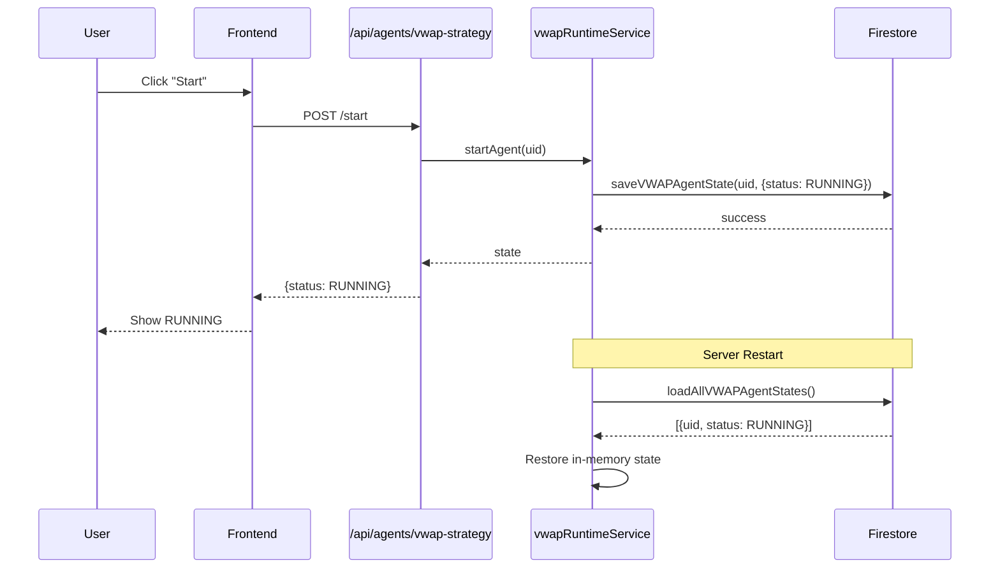

# Design Document: Agent System Comprehensive Fix

## Overview

This design addresses critical issues in the DLXTrade trading platform's agent system. The primary focus areas are:

1. **VWAP State Persistence**: Converting the in-memory VWAP runtime service to use Firestore persistence
2. **Unified Diagnostics**: Implementing consistent diagnostic logging and API responses across all four agents
3. **Frontend Consistency**: Ensuring all agent pages display diagnostics correctly and handle errors gracefully
4. **Build Stability**: Resolving TypeScript errors and ensuring clean builds

The solution maintains backward compatibility while adding persistence and improving observability.

## Architecture

```mermaid
graph TB
    subgraph Frontend
        VWAPPage[VWAPStrategy.tsx]
        TradingPage[TradingAgentControl.tsx]
        CrowdPage[CrowdConsensus.tsx]
    end

    subgraph Backend Routes
        AgentsRoutes[/api/agents/*]
    end

    subgraph Services
        VWAPRuntime[vwapRuntimeService]
        TradingAgent[TradingAgent]
        CrowdService[CrowdConsensusService]
    end

    subgraph Schedulers
        TradingScheduler[tradingAgentScheduler]
        CrowdScheduler[CrowdConsensusScheduler]
    end

    subgraph Persistence
        FirestoreAdapter[firestoreAdapter]
        Firestore[(Firestore)]
    end

    VWAPPage --> AgentsRoutes
    TradingPage --> AgentsRoutes
    CrowdPage --> AgentsRoutes

    AgentsRoutes --> VWAPRuntime
    AgentsRoutes --> TradingAgent
    AgentsRoutes --> CrowdService

    TradingScheduler --> VWAPRuntime
    TradingScheduler --> TradingAgent
    CrowdScheduler --> CrowdService

    VWAPRuntime --> FirestoreAdapter
    TradingAgent --> FirestoreAdapter
    CrowdService --> FirestoreAdapter

    FirestoreAdapter --> Firestore
```

### Data Flow for VWAP State Persistence



## Components and Interfaces

### 1. VWAPRuntimeService (Enhanced)

**Location**: `dlxtrade-ws/src/services/vwapRuntimeService.ts`

**Changes**:
- Add Firestore persistence for all state changes
- Add `loadPersistedStates()` method for server startup
- Add `saveState()` and `loadState()` private methods

```typescript
interface VWAPPersistedState {
  agentId: string;
  userId: string;
  status: 'STOPPED' | 'RUNNING';
  strategyType: 'VWAP_MEAN_REVERSION';
  exchange?: string;
  startedAt?: Timestamp;
  lastHeartbeat?: Timestamp;
  stoppedAt?: Timestamp;
  stoppedReason?: string;
  stoppedForDayKey?: string;
  dayKey?: string;
  dayStartEquity?: number;
}
```

### 2. FirestoreAdapter (Enhanced)

**Location**: `dlxtrade-ws/src/services/firestoreAdapter.ts`

**New Methods**:
```typescript
// VWAP State Persistence
saveVWAPAgentState(uid: string, state: VWAPPersistedState): Promise<void>
getVWAPAgentState(uid: string): Promise<VWAPPersistedState | null>
getAllRunningVWAPAgents(): Promise<VWAPPersistedState[]>

// Agent Diagnostics
saveAgentDiagnostic(agentId: string, diagnostic: AgentDiagnostic): Promise<void>
getAgentDiagnostics(agentId: string, limit?: number): Promise<AgentDiagnostic[]>
```

### 3. Agent Diagnostics Interface

**Shared across all agents**:
```typescript
interface AgentDiagnostic {
  id?: string;
  timestamp: Date;
  agentId: string;
  agentType: 'TRADING_AGENT' | 'VWAP_STRATEGY' | 'LIQUIDITY_SWEEP_AGENT' | 'COPY_TRADING_AGENT';
  tradingPair?: string;
  decision: {
    action: 'TRADE' | 'SKIP' | 'STOPPED_FOR_DAY';
    reason: DiagnosticReason;
  };
  signal?: {
    direction: 'LONG' | 'SHORT';
    entryPrice: number;
    stopLoss: number;
    takeProfit: number;
    rrRatio: number;
  };
  execution?: {
    success: boolean;
    orderId?: string;
    error?: string;
  };
}

type DiagnosticReason = 
  | 'NO_SIGNAL'
  | 'RR_TOO_LOW'
  | 'RISK_LIMIT'
  | 'SESSION_FILTER'
  | 'EXCHANGE_ERROR'
  | 'DAILY_LIMIT_REACHED'
  | 'NO_CONSENSUS'
  | 'ENTRY_LATE'
  | 'SR_BLOCKED'
  | 'STOPPED_FOR_DAY'
  | 'EXECUTED';
```

### 4. Diagnostics API Response Interface

```typescript
interface DiagnosticsResponse {
  diagnostics: AgentDiagnostic[];
  scheduler: {
    isRunning: boolean;
    lastExecutionAt: Date | null;
    nextExecutionAt: Date | null;
    lastExecutionError: string | null;
    intervalMs: number;
  };
  runtime?: {  // VWAP only
    status: 'RUNNING' | 'STOPPED';
    stoppedReason: string | null;
    stoppedForDayKey: string | null;
    lastHeartbeat: Date | null;
  };
  status?: {  // Crowd Consensus only
    gate: 'READY' | 'AUTO_TRADE_DISABLED' | 'EXCHANGE_NOT_CONNECTED' | 'DAILY_LIMIT_REACHED';
    message: string;
    autoTradeEnabled: boolean;
    dailyTradeCount: number;
    dailyTradeLimit: number;
  };
}
```

## Data Models

### Firestore Collections

#### 1. VWAP Agent State
**Path**: `users/{uid}/agents/vwap_strategy`

```typescript
{
  agentId: string;           // "vwap_{uid}"
  userId: string;            // uid
  status: 'STOPPED' | 'RUNNING';
  strategyType: 'VWAP_MEAN_REVERSION';
  exchange?: string;
  startedAt?: Timestamp;
  lastHeartbeat?: Timestamp;
  stoppedAt?: Timestamp;
  stoppedReason?: string;
  stoppedForDayKey?: string; // "2024-01-15" format
  dayKey?: string;
  dayStartEquity?: number;
  updatedAt: Timestamp;
}
```

#### 2. Agent Diagnostics
**Path**: `agentDiagnostics/{agentId}/logs/{logId}`

```typescript
{
  timestamp: Timestamp;
  agentId: string;
  agentType: string;
  tradingPair?: string;
  decision: {
    action: string;
    reason: string;
  };
  signal?: object;
  execution?: object;
}
```

### Existing Collections (Reference)

#### Trading Agents
**Path**: `tradingAgents/{agentId}`
- Used by TRADING_AGENT and LIQUIDITY_SWEEP_AGENT
- Contains status, config, and performance metrics

#### Crowd Consensus Settings
**Path**: `users/{uid}/agents/crowd_consensus_copy_trade`
- Contains autoTradeEnabled, selectedAutoTradeExchange, etc.


## Correctness Properties

*A property is a characteristic or behavior that should hold true across all valid executions of a system—essentially, a formal statement about what the system should do. Properties serve as the bridge between human-readable specifications and machine-verifiable correctness guarantees.*

### Property 1: VWAP State Persistence Round-Trip

*For any* user ID and VWAP agent state (RUNNING or STOPPED), saving the state to Firestore and then loading it back should produce an equivalent state object.

**Validates: Requirements 1.1, 1.4, 9.5**

### Property 2: VWAP State Restoration on Startup

*For any* set of persisted VWAP agent states in Firestore where status is RUNNING, after calling `loadPersistedStates()`, the in-memory runtime service should contain all those agents in RUNNING state.

**Validates: Requirements 1.3, 9.1, 9.2**

### Property 3: VWAP StoppedForDayKey Enforcement

*For any* VWAP agent state with stoppedForDayKey equal to today's date, attempting to start the agent should fail and the agent should remain in STOPPED state.

**Validates: Requirements 1.6, 9.3**

### Property 4: VWAP Heartbeat Update

*For any* VWAP agent in RUNNING state, after a scheduler cycle executes, the lastHeartbeat timestamp in Firestore should be more recent than before the cycle.

**Validates: Requirements 1.5**

### Property 5: Scheduler Diagnostic Storage

*For any* scheduler cycle execution (Trading Agent, VWAP, or Crowd Consensus), a diagnostic log entry should be created in Firestore with a timestamp within the last minute.

**Validates: Requirements 2.1, 2.2, 2.3, 5.4**

### Property 6: Diagnostic Log Structure

*For any* diagnostic log entry, it should contain all required fields: timestamp, agentId, decision.action, and decision.reason.

**Validates: Requirements 2.4**

### Property 7: Diagnostics Default Limit

*For any* agent with more than 20 diagnostic entries, calling `getAgentDiagnostics(agentId)` without a limit parameter should return exactly 20 entries.

**Validates: Requirements 2.6**

### Property 8: Diagnostics API Response Structure

*For any* valid agent ID, calling GET /api/agents/:agentId/diagnostics should return a response containing scheduler.isRunning, scheduler.lastExecutionAt, and scheduler.nextExecutionAt fields.

**Validates: Requirements 3.1**

### Property 9: API Error-Free Responses

*For any* authenticated user with proper agent access, loading an agent page should not result in 410, 400, or 403 HTTP status codes.

**Validates: Requirements 6.1, 6.2, 6.3**

### Property 10: VWAP Scheduler Execution Filter

*For any* VWAP agent in STOPPED state, the scheduler should not execute trading logic for that agent during a cycle.

**Validates: Requirements 9.4**

## Error Handling

### Backend Error Handling

1. **Firestore Connection Errors**
   - If Firestore is unavailable during state save, log error and continue with in-memory state
   - On server restart, if Firestore load fails, start with empty state and log warning
   - Never crash the server due to Firestore errors

2. **Invalid State Errors**
   - If persisted state is corrupted, skip that agent and log error
   - If stoppedForDayKey has invalid format, treat as no stop-for-day

3. **Scheduler Errors**
   - Wrap each agent execution in try-catch
   - Store error in lastExecutionError field
   - Continue with next agent on error

### Frontend Error Handling

1. **API Errors**
   - Display toast notification for failed API calls
   - Show "Loading..." state while fetching
   - Show "No data" state if API returns empty

2. **Missing Data**
   - If diagnostics array is empty, show "No diagnostics yet"
   - If scheduler status is null, show "Scheduler status unavailable"

## Testing Strategy

### Unit Tests

Unit tests should focus on specific examples and edge cases:

1. **VWAPRuntimeService**
   - Test startAgent saves to Firestore
   - Test stopAgent saves to Firestore
   - Test loadPersistedStates restores state
   - Test stoppedForDayKey logic

2. **FirestoreAdapter**
   - Test saveVWAPAgentState creates document
   - Test getVWAPAgentState retrieves document
   - Test getAllRunningVWAPAgents filters correctly

3. **Diagnostics**
   - Test saveAgentDiagnostic creates entry
   - Test getAgentDiagnostics returns correct limit
   - Test diagnostic structure validation

### Property-Based Tests

Property-based tests should use a library like `fast-check` for TypeScript. Each test should run minimum 100 iterations.

**Configuration**:
- Library: `fast-check`
- Minimum iterations: 100
- Tag format: `Feature: agent-system-comprehensive-fix, Property N: {property_text}`

**Property Tests to Implement**:

1. **Property 1: VWAP State Persistence Round-Trip**
   - Generate random VWAPPersistedState objects
   - Save to Firestore, load back, compare

2. **Property 2: VWAP State Restoration on Startup**
   - Generate random set of running agents
   - Persist to Firestore, call loadPersistedStates
   - Verify all are in runtime service

3. **Property 3: VWAP StoppedForDayKey Enforcement**
   - Generate random agents with today's stoppedForDayKey
   - Attempt to start, verify failure

4. **Property 5: Scheduler Diagnostic Storage**
   - Run scheduler cycle
   - Verify diagnostic entry exists with recent timestamp

5. **Property 6: Diagnostic Log Structure**
   - Generate random diagnostic entries
   - Verify all required fields present

6. **Property 7: Diagnostics Default Limit**
   - Create 50 diagnostic entries
   - Call without limit, verify 20 returned

### Integration Tests

1. **End-to-End VWAP Flow**
   - Start agent via API
   - Verify Firestore state
   - Simulate server restart
   - Verify state restored

2. **Diagnostics API**
   - Call diagnostics endpoint for each agent type
   - Verify response structure matches interface

3. **Frontend Rendering**
   - Load each agent page
   - Verify diagnostics section renders
   - Verify no console errors
