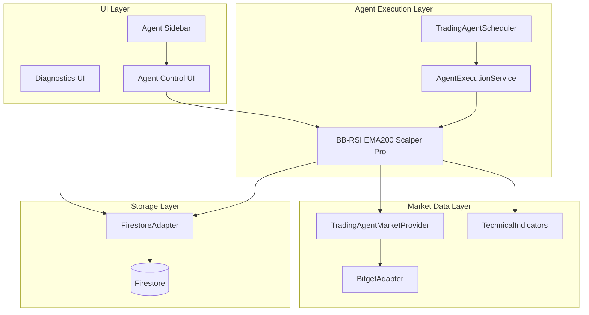

# Design Document: BB-RSI EMA200 Scalper Pro

## Overview

The BB-RSI EMA200 Scalper Pro is a sophisticated mean reversion scalping agent designed for high-frequency futures trading on Bitget USDT-M Perpetual contracts. The agent combines multiple technical indicators (Bollinger Bands, RSI, EMA200, Volume MA, ADX) to identify precise mean reversion opportunities on 3-minute and 5-minute timeframes with comprehensive risk management.

The design follows the existing agent architecture patterns established by HTF Trend Filter and other agents, integrating seamlessly with AgentExecutionService, BitgetAdapter, and the existing UI/diagnostic systems.

## Architecture

### System Integration Architecture



### Agent Class Hierarchy

The BB-RSI EMA200 Scalper Pro will extend the existing TradingAgent architecture:

```typescript
// Extends existing TradingAgent class
class BBRSIEMAScalperStrategy {
  // Strategy-specific implementation
  static analyzeMarketConditions(candles3m: CandleData[], candles5m: CandleData[]): MarketAnalysis
  static generateSignal(analysis: MarketAnalysis, currentCandle: CandleData): TradingSignal | null
  static calculateRiskManagement(signal: TradingSignal, accountBalance: number): RiskCalculation
}

// Integration with existing TradingAgent
TradingAgent.generateSignal() {
  if (this.config.strategyType === 'BB_RSI_EMA200_SCALPER') {
    return this.generateBBRSIEMAScalperSignal(candle, indicators, recentCandles);
  }
  // ... existing strategies
}
```

## Components and Interfaces

### 1. BB-RSI EMA200 Scalper Strategy Component

**Purpose:** Core strategy logic for mean reversion scalping

**Key Methods:**
- `analyzeMarketConditions()`: Multi-timeframe technical analysis
- `generateLongSignal()`: Long entry signal generation
- `generateShortSignal()`: Short entry signal generation
- `calculatePositionSize()`: Risk-based position sizing
- `calculateStopLoss()`: Swing-based stop loss calculation
- `calculateTakeProfit()`: Multi-level take profit calculation

**Integration Points:**
- Extends existing TradingAgent signal generation
- Uses existing TechnicalIndicators service
- Follows existing diagnostic logging patterns

### 2. Market Analysis Component

**Purpose:** Multi-timeframe technical indicator analysis

**Technical Indicators:**
- EMA200 (trend filter)
- Bollinger Bands (20, 2.0) (mean reversion)
- RSI(14) (momentum)
- Volume MA(20) (confirmation)
- ADX(14) (trend strength filter)

**Data Requirements:**
- Primary: 3-minute candles (250 periods for EMA200)
- Secondary: 5-minute candles (250 periods for confirmation)
- Real-time: Current candle data for signal generation

### 3. Risk Management Component

**Purpose:** Comprehensive risk control and position management

**Risk Parameters:**
- Risk per trade: 0.75% (configurable, max 1%)
- Leverage: 5x (configurable 3x-8x)
- Daily drawdown limit: 5%
- Equity drawdown limit: 12%
- Consecutive loss limit: 3 trades
- Re-entry cooldown: 2 candles

**Stop Loss Logic:**
- Long: min(swing_low_last_5_candles, LowerBand - 0.15%)
- Short: max(swing_high_last_5_candles, UpperBand + 0.15%)

**Take Profit Logic:**
- TP1: Middle Bollinger Band (close 60%)
- TP2: +0.8% profit OR opposite BB (close 40%)
- Trailing stop: Activate at +0.4% profit with 0.25% distance

### 4. Safety Circuit Breakers

**Purpose:** Automated safety mechanisms to prevent excessive losses

**Circuit Breaker Types:**
1. **Daily Drawdown Circuit Breaker**
   - Trigger: 5% daily loss
   - Action: Halt trading for remainder of day
   - Reset: Next trading day at 00:00 UTC

2. **Equity Drawdown Circuit Breaker**
   - Trigger: 12% equity drawdown from peak
   - Action: Halt trading until manual reset
   - Reset: Manual admin intervention required

3. **Consecutive Loss Circuit Breaker**
   - Trigger: 3 consecutive losing trades
   - Action: Pause trading for 30 minutes
   - Reset: Automatic after cooldown period

4. **Market Condition Circuit Breaker**
   - Trigger: ADX > 30 (strong trend)
   - Action: Skip trading cycle
   - Reset: Next cycle when ADX ≤ 30

## Data Models

### BB-RSI EMA200 Configuration Model

```typescript
interface BBRSIEMAScalperConfig extends TradingAgentConfig {
  strategyType: 'BB_RSI_EMA200_SCALPER';
  
  // Trading Parameters
  primaryTimeframe: '3m' | '5m'; // Default: '3m'
  secondaryTimeframe: '5m' | '15m'; // Default: '5m'
  supportedPairs: ['BTCUSDT', 'ETHUSDT', 'SOLUSDT', 'BNBUSDT', 'XRPUSDT'];
  
  // Risk Management
  riskPerTrade: number; // 0.75% default, max 1%
  leverage: number; // 5x default, range 3x-8x
  dailyDrawdownLimit: number; // 5% fixed
  equityDrawdownLimit: number; // 12% fixed
  
  // Technical Parameters
  ema200Period: number; // 200 fixed
  bbPeriod: number; // 20 fixed
  bbStdDev: number; // 2.0 fixed
  rsiPeriod: number; // 14 fixed
  volumeMAPeriod: number; // 20 fixed
  adxPeriod: number; // 14 fixed
  adxThreshold: number; // 30 fixed
  
  // Entry Conditions
  rsiOversoldLevel: number; // 30 fixed
  rsiOverboughtLevel: number; // 70 fixed
  
  // Exit Conditions
  tp1Percentage: number; // 60% position close at middle BB
  tp2Percentage: number; // 40% position close at +0.8% or opposite BB
  trailingStopTrigger: number; // 0.4% profit
  trailingStopDistance: number; // 0.25%
  maxHoldCandles: number; // 12 candles
  
  // Safety Rules
  consecutiveLossLimit: number; // 3 fixed
  reEntryCooldownCandles: number; // 2 fixed
  pauseDurationMinutes: number; // 30 fixed
}
```

### Market Analysis Model

```typescript
interface BBRSIEMAMarketAnalysis {
  timestamp: Date;
  symbol: string;
  timeframe: string;
  
  // Trend Analysis
  trendDirection: 'LONG_ONLY' | 'SHORT_ONLY' | 'NO_TRADE';
  ema200: number;
  currentPrice: number;
  priceVsEMA200: 'ABOVE' | 'BELOW';
  
  // Mean Reversion Analysis
  bollingerBands: {
    upper: number;
    middle: number;
    lower: number;
    bandWidth: number;
    pricePosition: 'ABOVE_UPPER' | 'BETWEEN' | 'BELOW_LOWER' | 'TOUCHING_UPPER' | 'TOUCHING_LOWER';
  };
  
  // Momentum Analysis
  rsi: {
    value: number;
    condition: 'OVERSOLD' | 'OVERBOUGHT' | 'NEUTRAL';
    previousValue: number;
    divergence: boolean;
  };
  
  // Volume Analysis
  volume: {
    current: number;
    ma20: number;
    confirmation: boolean;
    spike: boolean;
  };
  
  // Trend Strength Filter
  adx: {
    value: number;
    trendStrength: 'WEAK' | 'MODERATE' | 'STRONG';
    allowTrading: boolean;
  };
  
  // Signal Readiness
  longSetupReady: boolean;
  shortSetupReady: boolean;
  confirmationRequired: boolean;
}
```

### Trading Signal Model

```typescript
interface BBRSIEMAScalperSignal extends TradingSignal {
  strategyType: 'BB_RSI_EMA200_SCALPER';
  
  // Signal Details
  setupType: 'LONG_MEAN_REVERSION' | 'SHORT_MEAN_REVERSION';
  confirmationCandle: boolean;
  signalStrength: 'WEAK' | 'MODERATE' | 'STRONG';
  
  // Entry Details
  entryReason: string;
  entryConditions: {
    trendFilter: boolean;
    meanReversion: boolean;
    momentumConfirmation: boolean;
    volumeConfirmation: boolean;
    trendStrengthFilter: boolean;
  };
  
  // Risk Management
  riskRewardRatio: number;
  positionSizeUSD: number;
  marginRequired: number;
  
  // Exit Levels
  stopLoss: {
    price: number;
    type: 'SWING_BASED' | 'BB_BASED';
    distance: number;
  };
  
  takeProfit1: {
    price: number;
    percentage: number; // 60%
    target: 'MIDDLE_BB';
  };
  
  takeProfit2: {
    price: number;
    percentage: number; // 40%
    target: 'PROFIT_TARGET' | 'OPPOSITE_BB';
  };
  
  trailingStop: {
    triggerPrice: number;
    distance: number;
  };
  
  // Timing
  maxHoldTime: number; // in minutes
  expectedDuration: number; // estimated based on historical data
}
```

Now I need to use the prework tool to analyze the acceptance criteria before writing the correctness properties:

<function_calls>
<invoke name="prework">
<parameter name="featureName">bb-rsi-ema200-scalper-pro

## Correctness Properties

*A property is a characteristic or behavior that should hold true across all valid executions of a system-essentially, a formal statement about what the system should do. Properties serve as the bridge between human-readable specifications and machine-verifiable correctness guarantees.*

### Property Reflection

After analyzing all acceptance criteria, I identified several areas where properties can be consolidated to eliminate redundancy:

- Properties 2.8 and 6.6 both test ADX-based trading skip logic - these will be combined into one comprehensive property
- Properties 3.1-3.6 and 4.1-4.6 follow similar patterns for long/short signal generation - these can be grouped into comprehensive signal generation properties
- Multiple configuration validation properties (10.1-10.7) can be combined into comprehensive configuration validation properties
- Logging properties (9.1-9.7) can be consolidated into comprehensive logging verification properties

### Core Strategy Properties

**Property 1: Agent Registration and Configuration**
*For any* user registration request, the BB-RSI EMA200 Scalper Pro should create a new agent instance with correct default configuration (5x leverage, 0.75% risk, approved trading pairs only, PENDING_APPROVAL status)
**Validates: Requirements 1.1, 1.2, 1.3, 1.4, 1.5, 1.6**

**Property 2: Technical Indicator Calculation**
*For any* valid candle data with sufficient history, all technical indicators (EMA200, Bollinger Bands 20/2.0, RSI 14, Volume MA 20, ADX 14) should be calculated correctly with proper parameters
**Validates: Requirements 2.3, 2.4, 2.5, 2.6, 2.7**

**Property 3: Multi-Timeframe Data Fetching**
*For any* market analysis request, the agent should fetch both 3-minute primary and 5-minute secondary timeframe data with sufficient candle history (250+ periods)
**Validates: Requirements 2.1, 2.2**

**Property 4: ADX Trend Strength Filter**
*For any* market condition where ADX exceeds 30, the agent should skip trading to avoid strong trending markets
**Validates: Requirements 2.8, 6.6**

### Signal Generation Properties

**Property 5: Long Signal Generation Logic**
*For any* market condition, long signals should only be generated when price > EMA200, candle low touches/breaks lower BB, RSI ≤ 30, confirmation candle closes inside BB, and volume > Volume MA
**Validates: Requirements 3.1, 3.2, 3.3, 3.4, 3.5, 3.6**

**Property 6: Short Signal Generation Logic**
*For any* market condition, short signals should only be generated when price < EMA200, candle high touches/breaks upper BB, RSI ≥ 70, confirmation candle closes inside BB, and volume > Volume MA
**Validates: Requirements 4.1, 4.2, 4.3, 4.4, 4.5, 4.6**

### Risk Management Properties

**Property 7: Position Sizing Calculation**
*For any* valid trading signal and account balance, position size should be calculated based on 0.75% account risk with proper leverage application and margin safety checks
**Validates: Requirements 5.1**

**Property 8: Stop Loss Calculation**
*For any* long position, stop loss should be set at minimum of swing low from last 5 candles or Lower Band minus 0.15%, and for short positions at maximum of swing high from last 5 candles or Upper Band plus 0.15%
**Validates: Requirements 5.2, 5.3**

**Property 9: Take Profit Management**
*For any* position, first take profit should be set at Middle Bollinger Band (close 60%), second take profit at +0.8% or opposite BB (close 40%), with trailing stop activation at +0.4% profit
**Validates: Requirements 5.4, 5.5, 5.6**

**Property 10: Maximum Hold Time Enforcement**
*For any* open position, the agent should enforce maximum hold time of 12 candles and close positions that exceed this duration
**Validates: Requirements 5.7**

### Safety Circuit Breaker Properties

**Property 11: Daily Drawdown Circuit Breaker**
*For any* trading day, when daily drawdown reaches 5%, all trading should be halted for the remainder of the day
**Validates: Requirements 6.1**

**Property 12: Equity Drawdown Circuit Breaker**
*For any* equity level, when drawdown from peak reaches 12%, all trading should be halted until manual reset
**Validates: Requirements 6.2**

**Property 13: Consecutive Loss Circuit Breaker**
*For any* sequence of trades, when 3 consecutive losses occur, trading should be paused for 30 minutes
**Validates: Requirements 6.3**

**Property 14: Re-entry Cooldown Enforcement**
*For any* trading pair, after a trade closes, re-entry should be prevented for 2 candles on the same pair
**Validates: Requirements 6.4**

**Property 15: Market Condition Filtering**
*For any* market scan, trading should be skipped when spread is too high, liquidity is low, or market conditions are unfavorable
**Validates: Requirements 6.5**

### Exchange Integration Properties

**Property 16: Order Execution Sequence**
*For any* valid trading signal, the agent should place market entry order, immediately follow with stop loss order, then place take profit orders in correct sequence
**Validates: Requirements 7.3, 7.4, 7.5**

**Property 17: Isolated Margin Mode Enforcement**
*For any* position opened, the agent should use isolated margin mode exclusively for all USDT-M futures trades
**Validates: Requirements 7.2**

**Property 18: Order Failure Handling**
*For any* order execution failure, the agent should handle errors gracefully with proper logging and not leave orphaned positions
**Validates: Requirements 7.6**

**Property 19: Dry-Run Mode Verification**
*For any* trading signal in dry-run mode, the agent should simulate all trading logic without placing real orders on the exchange
**Validates: Requirements 7.7**

### System Integration Properties

**Property 20: Diagnostic Data Storage**
*For any* trading cycle, diagnostic data should be stored in the existing format with all required fields for UI display
**Validates: Requirements 8.2, 9.5**

**Property 21: Trade History Storage**
*For any* executed trade, trade data should be stored in the existing trade storage system with complete trade lifecycle information
**Validates: Requirements 8.4**

**Property 22: Performance Metrics Tracking**
*For any* completed trade, performance metrics should be updated and tracked through the existing performance tracking system
**Validates: Requirements 8.5, 9.7**

### Configuration Management Properties

**Property 23: Configuration Validation**
*For any* configuration change request, the agent should validate leverage (3x-8x), risk per trade (≤1%), trading pairs (approved list only), and timeframes (3m/5m) before applying changes
**Validates: Requirements 10.1, 10.2, 10.3, 10.4, 10.6**

**Property 24: Safety Parameter Protection**
*For any* configuration modification attempt, core safety parameters (drawdown limits, consecutive loss limits, cooldown periods) should remain immutable
**Validates: Requirements 10.5**

**Property 25: Configuration Persistence**
*For any* valid configuration change, the new configuration should be persisted in the existing agent storage system and survive system restarts
**Validates: Requirements 10.7**

### Comprehensive Logging Properties

**Property 26: Complete Decision Logging**
*For any* trading cycle, all signal generation decisions, risk calculations, order attempts, and safety rule activations should be logged with complete context and indicator values
**Validates: Requirements 9.1, 9.2, 9.3, 9.4, 9.6**

## Error Handling

### Exchange Error Handling

The agent will implement comprehensive error handling for exchange-related failures:

1. **Connection Errors**
   - Retry logic with exponential backoff
   - Graceful degradation to skip cycles during outages
   - Automatic reconnection attempts

2. **Order Execution Errors**
   - Insufficient margin: Log error and skip trade
   - Invalid price: Recalculate and retry once
   - Rate limiting: Implement request throttling
   - Position limits: Respect exchange position limits

3. **Market Data Errors**
   - Stale data detection and handling
   - Missing candle interpolation where safe
   - Fallback to secondary data sources if available

### Risk Management Error Handling

1. **Position Sizing Errors**
   - Invalid account balance: Skip trading until resolved
   - Calculation overflow: Use conservative fallback sizing
   - Margin calculation errors: Default to minimum position size

2. **Stop Loss/Take Profit Errors**
   - Invalid price levels: Use conservative fallback levels
   - Order placement failures: Retry with adjusted prices
   - Partial fill handling: Adjust remaining orders accordingly

### System Integration Error Handling

1. **Database Errors**
   - Retry failed writes with exponential backoff
   - Cache critical data locally during outages
   - Graceful degradation of non-critical features

2. **Scheduler Integration Errors**
   - Handle missed execution cycles gracefully
   - Prevent duplicate executions through idempotency
   - Log scheduling anomalies for monitoring

## Testing Strategy

### Dual Testing Approach

The BB-RSI EMA200 Scalper Pro will use both unit testing and property-based testing for comprehensive coverage:

**Unit Tests:**
- Specific technical indicator calculations with known inputs/outputs
- Edge cases for signal generation logic
- Error condition handling scenarios
- Integration points with existing services
- Configuration validation edge cases

**Property-Based Tests:**
- Universal properties across all market conditions
- Signal generation consistency across random market data
- Risk management calculations across various account sizes
- Circuit breaker activation across different loss scenarios
- Configuration validation across all possible input ranges

### Property-Based Testing Configuration

The testing strategy will use **fast-check** (JavaScript/TypeScript property-based testing library) with the following configuration:

- **Minimum 100 iterations** per property test due to randomization
- Each property test will reference its design document property
- Tag format: **Feature: bb-rsi-ema200-scalper-pro, Property {number}: {property_text}**
- Each correctness property will be implemented by a SINGLE property-based test

### Test Data Generation

Property-based tests will generate:

1. **Market Data Generators**
   - Random candle sequences with realistic OHLCV data
   - Various market conditions (trending, ranging, volatile)
   - Different timeframe combinations

2. **Configuration Generators**
   - Valid and invalid configuration combinations
   - Edge cases for all configurable parameters
   - Boundary value testing for limits

3. **Account State Generators**
   - Various account balances and equity levels
   - Different drawdown scenarios
   - Trade history sequences for consecutive loss testing

### Integration Testing

1. **Exchange Integration Tests**
   - Mock BitgetAdapter responses for various scenarios
   - Order execution flow testing
   - Error condition simulation

2. **System Integration Tests**
   - AgentExecutionService integration
   - Diagnostic system integration
   - UI routing and control integration

3. **End-to-End Testing**
   - Complete trading cycle simulation
   - Multi-timeframe data processing
   - Risk management enforcement

### Performance Testing

1. **Latency Testing**
   - Signal generation performance under various market conditions
   - Technical indicator calculation performance
   - Order execution timing

2. **Memory Usage Testing**
   - Candle data storage efficiency
   - Memory leak detection during extended operation
   - Garbage collection impact analysis

3. **Throughput Testing**
   - Multiple concurrent agent instances
   - High-frequency signal generation scenarios
   - System resource utilization under load

The testing strategy ensures that the BB-RSI EMA200 Scalper Pro maintains the same reliability and robustness standards as existing agents while providing comprehensive validation of its unique mean reversion scalping logic.