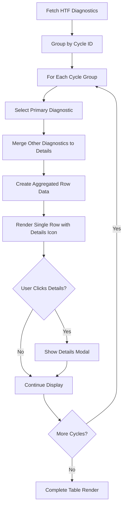

# Design Document: HTF Trend Filter Diagnostics Aggregation

## Overview

The HTF Trend Filter Agent diagnostics currently display multiple rows per research cycle, creating a cluttered user experience. The solution involves implementing client-side aggregation logic to group diagnostic entries by research cycle and display only one row per cycle with detailed information accessible through an expandable interface.

The fix will be implemented entirely in the frontend by modifying the existing diagnostic display logic. No backend changes, new APIs, or schema modifications are required.

## Architecture

### Current Architecture
```
HTF Diagnostics Display Flow:
1. Backend saves multiple diagnostic entries per cycle:
   - EXECUTION_STARTED
   - FORCE_CREATE_DIAGNOSTIC  
   - EMA rejected
   - RSI rejected
   - Volume rejected
   - SR rejected
   - CREDENTIALS_DECRYPT_FAILED (if applicable)
2. Frontend fetches all entries
3. Frontend displays each entry as separate row
4. Result: Multiple rows per single research cycle

Current UI Structure:
┌─────────────┬──────────┬───────────┬──────────────┐
│ Timestamp   │ Pair     │ Direction │ Decision     │
├─────────────┼──────────┼───────────┼──────────────┤
│ 10:00:01    │ BTCUSDT  │ --        │ STARTED      │
│ 10:00:02    │ --       │ --        │ FORCE_CREATE │
│ 10:00:03    │ BTCUSDT  │ --        │ EMA rejected │
│ 10:00:04    │ BTCUSDT  │ --        │ RSI rejected │
│ 10:00:05    │ BTCUSDT  │ SKIPPED   │ Volume low   │
└─────────────┴──────────┴───────────┴──────────────┘
```

### Target Architecture
```
HTF Diagnostics Display Flow:
1. Backend saves multiple diagnostic entries per cycle (unchanged)
2. Frontend fetches all entries
3. Frontend aggregates entries by cycle identifier
4. Frontend selects primary diagnostic (EXECUTED > SKIPPED)
5. Frontend displays one row per cycle with details icon
6. Result: Clean, professional diagnostic history

Enhanced UI Structure:
┌─────────────┬──────────┬───────────┬──────────────┐
│ Timestamp   │ Pair     │ Direction │ Decision     │
├─────────────┼──────────┼───────────┼──────────────┤
│ 10:00:05    │ BTCUSDT  │ SKIPPED   │ Volume low ⓘ │
└─────────────┴──────────┴───────────┴──────────────┘

Details Modal/Expandable:
┌─────────────────────────────────────────────────────┐
│ Research Cycle Details - BTCUSDT (10:00:01-10:00:05)│
├─────────────────────────────────────────────────────┤
│ ✗ EMA rejected: Trend not confirmed                │
│ ✗ RSI rejected: Oversold condition not met         │
│ ✗ Volume rejected: Below minimum threshold          │
│ ✗ SR rejected: No clear support/resistance level   │
│ ℹ Credential issues: None                           │
└─────────────────────────────────────────────────────┘
```

## Components and Interfaces

### Modified Components

#### 1. HTF Diagnostics Display Component
**File**: Frontend component displaying HTF diagnostics (likely in AutoTrade.tsx or similar)
**Current Logic**: Renders all diagnostic entries as separate rows
**Modification**: Add aggregation logic before rendering

#### 2. Diagnostic Data Processing
**Current Logic**: Direct mapping from API response to table rows
**New Logic**: Aggregate → Select Primary → Merge Details → Render

#### 3. Details Modal/Expandable Component
**File**: New component or enhanced existing modal
**Purpose**: Display detailed breakdown of research cycle diagnostics

### Data Flow



## Data Models

### Aggregated Diagnostic Entry
```typescript
interface AggregatedDiagnosticEntry {
  // Primary diagnostic data (for table display)
  id: string;
  timestamp: Date;
  pair: string;                    // From primary diagnostic
  direction: 'LONG' | 'SHORT' | 'NO_TRADE' | 'SKIPPED';
  decision: string;                // From primary diagnostic
  status: 'EXECUTED' | 'SKIPPED';
  
  // Aggregation metadata
  cycleId?: string;
  researchId?: string;
  cycleStartTime: Date;
  cycleEndTime: Date;
  
  // Details for expandable view
  details: DiagnosticDetail[];
  hasDetails: boolean;
}

interface DiagnosticDetail {
  timestamp: Date;
  type: 'EXECUTION_STARTED' | 'FORCE_CREATE_DIAGNOSTIC' | 'INDICATOR_ANALYSIS' | 'CREDENTIALS_ERROR';
  message: string;
  indicator?: {
    name: 'EMA' | 'RSI' | 'Volume' | 'SR';
    status: 'confirmed' | 'rejected';
    details: string;
  };
  credentialIssue?: {
    type: 'DECRYPT_FAILED' | 'MISSING_KEYS';
    details: string;
  };
}
```

### Cycle Identification Strategy
```typescript
interface CycleIdentificationConfig {
  primaryKey: 'cycleId';           // Preferred identification method
  fallbackKeys: ['researchId'];    // Alternative identification
  timeWindowMs: 30000;             // 30 second window for timestamp grouping
  symbolGrouping: true;            // Group by symbol within time window
}

interface CycleGroup {
  identifier: string;              // cycleId, researchId, or generated key
  symbol: string;                  // Trading pair symbol
  entries: DiagnosticEntry[];      // All diagnostics in this cycle
  timeRange: {
    start: Date;
    end: Date;
  };
}
```

### Primary Diagnostic Selection Logic
```typescript
interface PrimarySelectionRules {
  priorityOrder: [
    'EXECUTED',                    // Highest priority
    'SKIPPED'                      // Lower priority
  ];
  
  tieBreakers: [
    'latest_timestamp',            // Most recent entry
    'most_complete_data'           // Entry with most fields populated
  ];
  
  requiredFields: [
    'pair',                        // Must have trading pair
    'direction',                   // Must have direction
    'decision'                     // Must have decision reason
  ];
}
```

## Correctness Properties

*A property is a characteristic or behavior that should hold true across all valid executions of a system-essentially, a formal statement about what the system should do. Properties serve as the bridge between human-readable specifications and machine-verifiable correctness guarantees.*

### Property 1: Single Row Per Cycle Guarantee
*For any* set of diagnostic entries from the same research cycle, the aggregation system should produce exactly one display row, regardless of how many individual diagnostic entries exist for that cycle.
**Validates: Requirements 1.1, 1.2, 1.3**

### Property 2: Cycle Identification Completeness
*For any* diagnostic entry, the system should successfully identify which research cycle it belongs to using cycleId, researchId, or timestamp+symbol grouping, ensuring no entries are orphaned or incorrectly grouped.
**Validates: Requirements 2.1, 2.2, 2.3, 2.4, 2.5**

### Property 3: Primary Diagnostic Selection Consistency
*For any* group of diagnostic entries from the same cycle, the system should consistently select the same primary diagnostic based on the priority rules (EXECUTED > SKIPPED > latest timestamp), ensuring deterministic display behavior.
**Validates: Requirements 3.1, 3.2, 3.3, 3.4, 3.5**

### Property 4: Details Preservation Completeness
*For any* research cycle with multiple diagnostic entries, all non-primary diagnostics should be preserved in the details array with complete information, ensuring no diagnostic data is lost during aggregation.
**Validates: Requirements 4.1, 4.2, 4.3, 4.4, 4.5**

### Property 5: UI Data Integrity
*For any* aggregated diagnostic row, the pair and direction fields should be populated from the primary diagnostic and never display "--" for valid research cycles with trading decisions.
**Validates: Requirements 7.1, 7.2, 7.3, 7.4, 7.5**

### Property 6: Internal Entry Filtering
*For any* set of diagnostic entries, internal lifecycle entries (EXECUTION_STARTED, FORCE_CREATE_DIAGNOSTIC, CREDENTIALS_DECRYPT_FAILED) should not appear as standalone rows but should be available in the details view.
**Validates: Requirements 6.1, 6.2, 6.3, 6.4, 6.5**

## Implementation Strategy

### Phase 1: Data Aggregation Logic
1. **Cycle Identification**: Implement grouping logic using cycleId/researchId/timestamp+symbol
2. **Primary Selection**: Implement priority-based selection of primary diagnostic
3. **Details Merging**: Aggregate non-primary diagnostics into details array

### Phase 2: UI Enhancement
1. **Table Modification**: Update table rendering to show aggregated rows
2. **Details Icon**: Add info icon (ⓘ) to Decision column for cycles with details
3. **Modal/Expandable**: Implement details display interface

### Phase 3: Data Quality Assurance
1. **Field Population**: Ensure pair and direction are never "--" for valid cycles
2. **Lifecycle Filtering**: Hide internal entries from main table view
3. **Error Handling**: Handle edge cases and malformed diagnostic data

## Error Handling

### Cycle Identification Failures
- **Missing Identifiers**: Use timestamp+symbol grouping as fallback
- **Ambiguous Grouping**: Log warning and use most recent timestamp
- **Orphaned Entries**: Create individual cycles for ungroupable entries

### Primary Selection Failures
- **No Valid Primary**: Use first entry with most complete data
- **Tie Conditions**: Use latest timestamp as tiebreaker
- **Missing Required Fields**: Use available fields and mark as incomplete

### Details Aggregation Errors
- **Malformed Entries**: Skip malformed entries but preserve valid ones
- **Large Detail Sets**: Implement pagination or truncation for very large detail arrays
- **Memory Constraints**: Implement lazy loading for details if needed

### UI Rendering Errors
- **Modal Display Issues**: Fallback to inline expansion if modal fails
- **Icon Rendering**: Fallback to text indicator if icon fails to load
- **Data Display**: Show raw data if formatting fails

## Testing Strategy

### Unit Testing Approach
- **Cycle Grouping**: Test grouping logic with known diagnostic sets
- **Primary Selection**: Test selection rules with various priority scenarios
- **Details Aggregation**: Test merging logic with different entry types
- **UI Components**: Test modal/expandable behavior and icon interactions

### Property-Based Testing Approach
- **Universal Properties**: Test that all properties hold across randomly generated diagnostic sets
- **Edge Cases**: Generate edge cases like missing identifiers, duplicate entries, malformed data
- **Configuration**: Minimum 100 iterations per property test
- **Comprehensive Coverage**: Test aggregation behavior across all possible diagnostic combinations

**Property Test Configuration**:
- Use existing frontend testing framework (likely Jest + React Testing Library)
- Each test runs minimum 100 iterations with randomized diagnostic data
- Tag format: **Feature: htf-trend-filter-diagnostics-aggregation, Property {number}: {property_text}**

### Integration Testing
- **End-to-End Flow**: Test complete flow from API fetch to UI display
- **User Interactions**: Test details modal opening and closing
- **Data Consistency**: Verify aggregated data matches original diagnostic information
- **Performance**: Test aggregation performance with large diagnostic datasets

### Testing Balance
Unit tests focus on specific aggregation logic and UI components, while property tests verify universal correctness across all possible diagnostic combinations. Integration tests ensure the complete user experience works correctly.