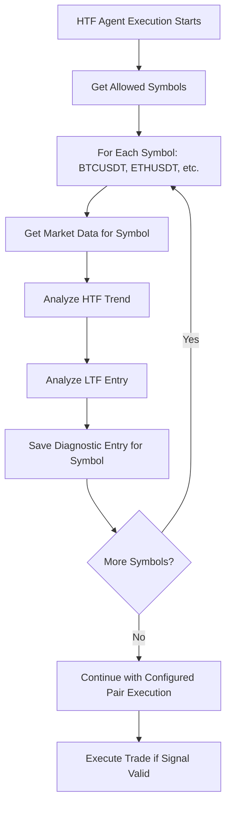

# Design Document: HTF Trend Filter Per-Symbol Diagnostics

## Overview

The HTF Trend Filter Agent currently evaluates only one configured trading pair and saves diagnostics as cycle-level summaries. This creates a mismatch with the frontend, which expects coin-level diagnostics for each symbol. The solution involves modifying the agent execution logic to iterate over all allowed trading symbols and save separate diagnostic entries for each symbol using the existing `firestoreAdapter.saveAgentDiagnostic()` method.

The fix will be implemented entirely in the backend by modifying the existing HTF agent execution logic in `agentExecutionService.ts`. No new files, collections, or frontend changes are required.

## Architecture

### Current Architecture
```
HTF Agent Execution Flow:
1. Agent starts with configured tradingPair (e.g., BTC/USDT)
2. Evaluates only that single pair
3. Saves one diagnostic entry per cycle
4. Frontend expects per-symbol data but receives cycle-level data

Current Diagnostic Storage:
users/{uid}/agentDiagnostics/{agentId}/entries/{auto-id}
- Single entry per execution cycle
- Contains only configured tradingPair
- Direction and reason are cycle-level summaries
```

### Target Architecture
```
HTF Agent Execution Flow:
1. Agent starts with configured tradingPair
2. Iterates over ALL allowed symbols (BTCUSDT, ETHUSDT, etc.)
3. Evaluates each symbol independently
4. Saves separate diagnostic entry for each symbol
5. Continues with execution logic for configured pair only

Enhanced Diagnostic Storage:
users/{uid}/agentDiagnostics/{agentId}/entries/{auto-id-1}  // BTCUSDT
users/{uid}/agentDiagnostics/{agentId}/entries/{auto-id-2}  // ETHUSDT
users/{uid}/agentDiagnostics/{agentId}/entries/{auto-id-3}  // ... other symbols
- Multiple entries per execution cycle
- Each entry contains specific symbol data
- Direction and reason are symbol-specific
```

## Components and Interfaces

### Modified Components

#### 1. AgentExecutionService
**File**: `dlxtrade-ws/src/services/agentExecutionService.ts`
**Current Logic**: Lines 614-770 (HTF agent execution block)
**Modification**: Extract symbol evaluation into separate loop before execution logic

#### 2. HTFTrendFilterStrategy
**File**: `dlxtrade-ws/src/services/htfTrendFilterStrategy.ts`
**Current Logic**: Already supports per-symbol analysis
**Modification**: None required - existing methods work per-symbol

#### 3. FirestoreAdapter
**File**: `dlxtrade-ws/src/services/firestoreAdapter.ts`
**Current Logic**: `saveAgentDiagnostic()` method already supports per-symbol entries
**Modification**: None required - existing method handles multiple calls

### Data Flow



## Data Models

### Enhanced Diagnostic Entry Structure
```typescript
interface SymbolDiagnosticEntry {
  agentType: 'HTF_TREND_FILTER_AGENT';
  tradingPair: string;           // 'BTC/USDT', 'ETH/USDT', etc.
  direction: 'LONG' | 'SHORT' | 'NO_TRADE';
  decision: {
    action: 'TRADE' | 'SKIP';
    reason: string;              // 'EMA rejected, RSI confirmed, ...'
    indicators?: {
      ema?: { status: 'confirmed' | 'rejected'; details: string };
      rsi?: { status: 'confirmed' | 'rejected'; details: string };
      vwap?: { status: 'confirmed' | 'rejected'; details: string };
      sr?: { status: 'confirmed' | 'rejected'; details: string };
      volume?: { status: 'confirmed' | 'rejected'; details: string };
    };
  };
  signal?: {
    direction: 'LONG' | 'SHORT';
    entryPrice: number;
    stopLoss: number;
    takeProfit: number;
    rrRatio: number;
  };
  runtimeState?: {
    htfTrend: HTFTrendAnalysis;
    ltfSignal: LTFEntrySignal;
    indicators: any;
  };
}
```

### Symbol Evaluation Configuration
```typescript
interface SymbolEvaluationConfig {
  allowedPairs: string[];        // ['BTC/USDT', 'ETH/USDT']
  configuredPair: string;        // Agent's configured trading pair
  evaluateAll: boolean;          // Always true for HTF agents
}
```

## Correctness Properties

*A property is a characteristic or behavior that should hold true across all valid executions of a system-essentially, a formal statement about what the system should do. Properties serve as the bridge between human-readable specifications and machine-verifiable correctness guarantees.*

### Property 1: Multi-Symbol Evaluation Coverage
*For any* HTF agent execution cycle, the agent should iterate over all allowed trading symbols, perform independent trend analysis for each symbol, and not rely solely on the configured trading pair.
**Validates: Requirements 1.1, 1.2, 1.3**

### Property 2: Symbol-Specific Analysis Results
*For any* evaluated trading symbol, the agent should determine a specific direction (LONG/SHORT/NO_TRADE) and generate decision reasons based on that symbol's individual market analysis.
**Validates: Requirements 1.4, 1.5**

### Property 3: Per-Symbol Diagnostic Persistence
*For any* evaluated trading symbol, the system should save exactly one separate diagnostic entry containing symbol-specific data (tradingPair, direction, decision.reason, status, agentId) and never merge multiple symbols into a single entry.
**Validates: Requirements 2.1, 2.2, 2.3, 2.4, 2.5, 2.6, 2.7, 2.8**

### Property 4: Frontend Data Compatibility
*For any* diagnostic entry saved by the HTF agent, the data should be formatted so the frontend can display symbol-specific information (pair, direction, reason) without showing "--" for valid symbols.
**Validates: Requirements 4.1, 4.2, 4.3, 4.4**

### Property 5: Data Integrity Validation
*For any* diagnostic entry, all required fields should be present and properly formatted (valid symbol names, valid direction values, meaningful decision reasons).
**Validates: Requirements 5.1, 5.2, 5.3, 5.4**

### Property 6: Error Resilience
*For any* symbol evaluation error, the agent should log the error, continue processing other symbols, and save appropriate diagnostic entries for both failed and successful evaluations.
**Validates: Requirements 5.5**

## Error Handling

### Symbol Evaluation Errors
- **Market Data Unavailable**: Save diagnostic with reason "MARKET_DATA_NOT_READY"
- **Insufficient Candles**: Save diagnostic with reason "INSUFFICIENT_DATA"
- **Analysis Failure**: Save diagnostic with reason "SYMBOL_EVALUATION_ERROR"
- **Continue Processing**: Errors for one symbol should not stop evaluation of other symbols

### Diagnostic Persistence Errors
- **Firestore Write Failure**: Log error but continue execution
- **Invalid Data Format**: Validate data before saving, use defaults for missing fields
- **Network Issues**: Retry mechanism already exists in firestoreAdapter

### Execution Logic Errors
- **Configured Pair Not in Allowed List**: Skip execution but continue diagnostic saving
- **Signal Generation Failure**: Save diagnostic with appropriate error reason
- **Exchange Connection Issues**: Save diagnostic with exchange-specific error details

## Testing Strategy

### Unit Testing Approach
- **Specific Examples**: Test diagnostic saving for known symbol combinations (BTCUSDT, ETHUSDT)
- **Edge Cases**: Test behavior when market data is unavailable or insufficient
- **Error Conditions**: Test error handling for invalid symbols or network failures
- **Integration Points**: Test interaction between symbol evaluation and diagnostic persistence

### Property-Based Testing Approach
- **Universal Properties**: Test that all properties hold across randomly generated symbol lists and market conditions
- **Comprehensive Coverage**: Generate random market data and verify diagnostic entries are created correctly
- **Configuration**: Minimum 100 iterations per property test
- **Test Tags**: Each property test references its design document property

**Property Test Configuration**:
- Use existing TypeScript testing framework (likely Jest)
- Each test runs minimum 100 iterations with randomized inputs
- Tag format: **Feature: htf-trend-filter-per-symbol-diagnostics, Property {number}: {property_text}**

### Testing Balance
Unit tests focus on specific examples and integration points, while property tests verify universal correctness across all possible inputs. Together they provide comprehensive coverage without excessive redundancy.